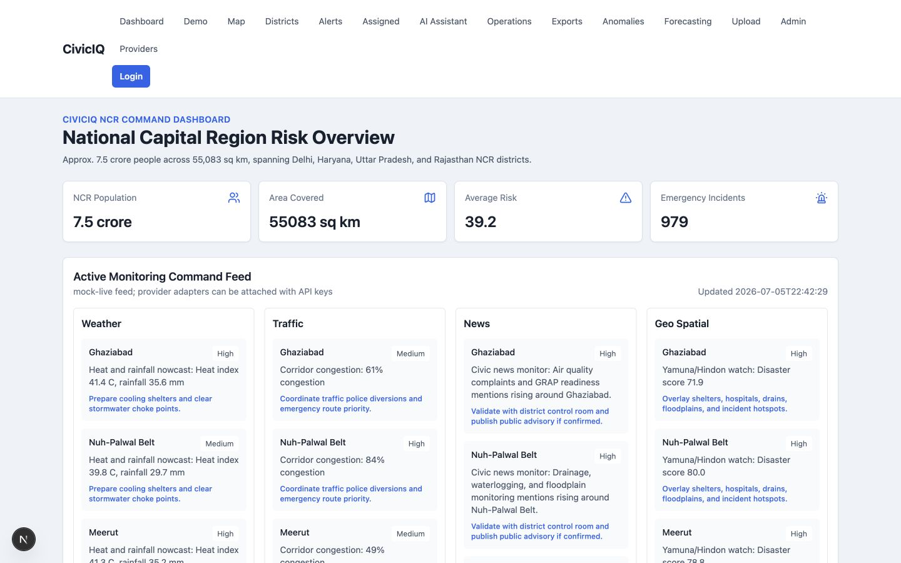
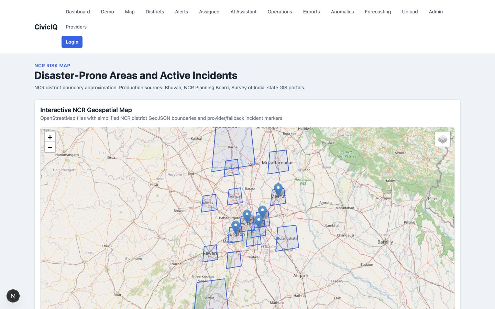
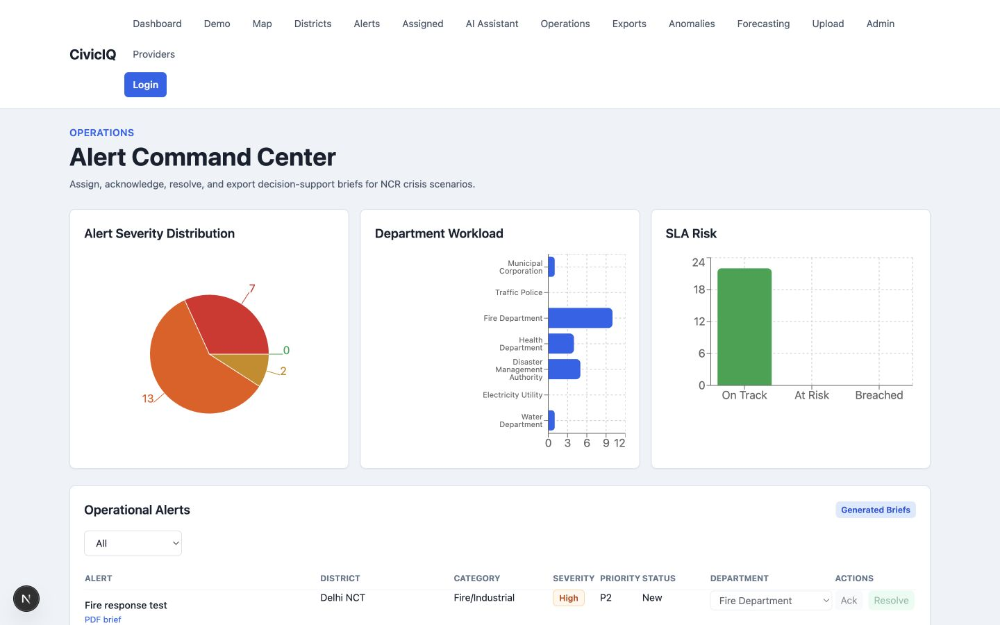
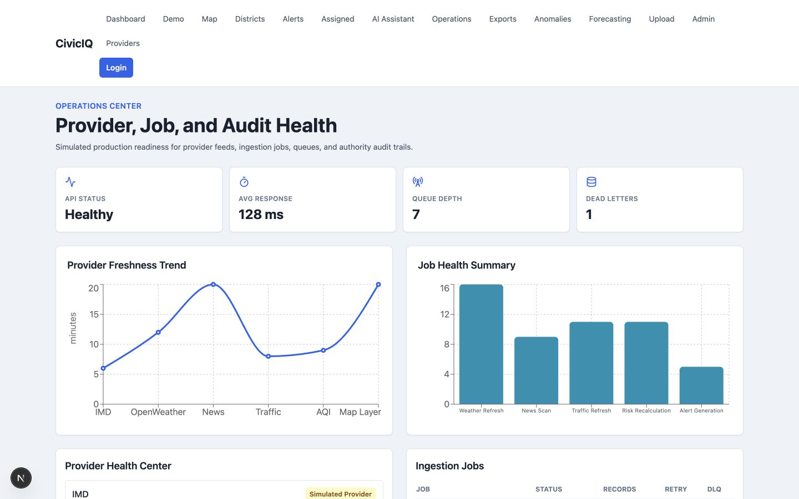

# CivicIQ — AI Decision Intelligence for NCR Disaster & Community Resilience

CivicIQ is a decision intelligence prototype for disaster response, civic operations, and community resilience across India’s National Capital Region. It helps authorities detect, understand, prioritize, and respond to risks across Delhi, Gurugram, Noida, Ghaziabad, Faridabad, and Meerut using AI, geospatial dashboards, realistic telemetry, and explainable recommendations.

## 30-Second Pitch

CivicIQ is an AI command center for NCR resilience. It combines weather, AQI, traffic, civic complaints, utility stress, emergency signals, maps, and alert workflows into one explainable decision layer so authorities can understand what is happening, why it matters, and which department should act first.

## Problem Statement

NCR authorities face fragmented signals during crises: weather alerts, civic complaints, traffic disruption, utility outages, emergency response load, AQI, and public safety events often arrive in separate systems. CivicIQ demonstrates how GenAI and decision intelligence can turn those signals into a single command-center view with evidence-backed action recommendations.

## Solution Overview

- Unified NCR command dashboard with risk KPIs, maps, charts, alerts, and live-feed simulation.
- One-click crisis demo that activates five realistic NCR disaster/civic scenarios.
- AI explainability panel showing why each recommendation was generated.
- Provider health and operations center for simulated/live feed status.
- Local exports that simulate signed incident brief URLs.
- Simple demo RBAC with role badges and protected operational actions.

## What It Does

- Monitors NCR districts across Delhi, Haryana, Uttar Pradesh, and Rajasthan.
- Uses default NCR sample data covering about 7.5 crore people across 55,083 sq km.
- Integrates provider adapters for news, weather, traffic, environmental data, geospatial layers, and disaster alerts.
- Uses GDELT by default for free news search, NewsAPI when `NEWS_API_KEY` is available, OpenWeather when `OPENWEATHER_API_KEY` is available, and fallback mock mode when keys are missing.
- Displays OpenStreetMap tiles with simplified NCR GeoJSON district boundaries and incident markers.
- Scores flood, heatwave, AQI/public health, seismic, drought/water-stress, and industrial/fire risks.
- Persists users, alerts, timelines, incidents, and ingestion job logs in SQLite.
- Supports alert assignment, acknowledgement, resolution, notes, SLA tracking, CSV export, Markdown briefs, and PDF incident briefs.
- Persists normalized provider observations for news, weather, traffic, AQI, and geospatial source checks.
- Provides demo JWT login roles for Admin, District Officer, Department User, Analyst, and Viewer.
- Includes Cloud Run deployment files for backend and frontend.

## Demo Scenarios

1. **Gurugram Urban Flooding**: 82 mm rainfall forecast, +240% waterlogging complaints, NH-48 delay, pump disruption. Flood risk: Critical.
2. **Delhi Heatwave and AQI Health Risk**: 47 C feels-like index, AQI 318, vulnerable population exposure. Public health risk: Critical.
3. **Noida Industrial Fire Risk**: industrial zone density, heat stress, recent smoke report, delayed response. Fire risk: High.
4. **Ghaziabad Utility and Water Stress**: water shortage complaints, power outage reports, rising temperature. Water stress risk: High.
5. **Meerut Storm and Public Safety Alert**: thunderstorm warning, road blockage, emergency call load. Public safety risk: High.

### Dashboard



NCR-wide disaster and civic risk overview with live-style KPIs.

### NCR Risk Map



District-level NCR risk visualization with incident markers.

### Alert Command Center



Operational workflow for assigning, acknowledging, and resolving alerts.

### Operations Center



Provider health, ingestion jobs, and system readiness indicators.

## Tech Stack

- Frontend: Next.js App Router, TypeScript, Tailwind CSS, Recharts, Leaflet, React Leaflet
- Backend: FastAPI, pandas, numpy, SQLAlchemy, SQLite, APScheduler, PyJWT
- AI: Mock/rule-based mode by default; Gemini-compatible mode with `GEMINI_API_KEY` or `GOOGLE_API_KEY`
- Data: Generated CSVs, SQLite runtime state, local GeoJSON, local RAG knowledge base

## Local Setup

```bash
cp .env.example .env
```

### Backend

```bash
cd backend
python3 -m venv .venv
. .venv/bin/activate
pip install -r requirements.txt
uvicorn main:app --reload
```

Backend default: `http://127.0.0.1:8000`

### Frontend

```bash
cd frontend
npm install
npm start
```

Frontend default: `http://127.0.0.1:3000`

If the backend runs on another port:

```bash
NEXT_PUBLIC_API_BASE_URL=http://127.0.0.1:8001 npm start
```

## Demo Credentials

- Admin: `admin@civiciq.demo` / `Admin@123`
- District Officer: `officer@civiciq.demo` / `Officer@123`
- Department User: `department@civiciq.demo` / `Department@123`
- Analyst: `analyst@civiciq.demo` / `Analyst@123`
- Viewer: `viewer@civiciq.demo` / `Viewer@123`

## Environment Variables

Backend:

- `PORT=8080`
- `DATABASE_URL=sqlite:///./civiciq.db`
- `JWT_SECRET_KEY=change-me`
- `JWT_ALGORITHM=HS256`
- `ACCESS_TOKEN_EXPIRE_MINUTES=1440`
- `GEMINI_API_KEY=`
- `GOOGLE_API_KEY=`
- `NEWS_API_KEY=`
- `OPENWEATHER_API_KEY=`
- `IMD_FEED_URL=`
- `IMD_ALERT_FEED_URL=`
- `IMD_API_KEY=`
- `GOOGLE_MAPS_API_KEY=`
- `TOMTOM_API_KEY=`
- `MAPBOX_ACCESS_TOKEN=`
- `ENABLE_SCHEDULER=false`
- `NEWS_REFRESH_MINUTES=30`
- `WEATHER_REFRESH_MINUTES=30`
- `TRAFFIC_REFRESH_MINUTES=15`
- `RISK_REFRESH_MINUTES=30`
- `ALERT_REFRESH_MINUTES=30`
- `JOB_MAX_RETRIES=3`
- `JOB_RETRY_BACKOFF_SECONDS=10`
- `JOB_TIMEOUT_SECONDS=60`
- `FAILURE_ALERTS_ENABLED=true`
- `PROVIDER_OBSERVATION_RETENTION_DAYS=30`
- `MOCK_MODE=true`
- `CORS_ORIGINS=http://localhost:3000,http://127.0.0.1:3000`

Frontend:

- `NEXT_PUBLIC_API_BASE_URL=http://127.0.0.1:8000`

## Public Deployment

### Vercel frontend

The frontend can be deployed from the `frontend` directory. Set `NEXT_PUBLIC_API_BASE_URL` to the public backend URL before the production build.

```bash
cd frontend
vercel --prod
```

### Vercel FastAPI backend

The backend includes a Vercel Python serverless entrypoint at `backend/api/index.py`. For demo deployments on serverless storage, set writable runtime paths to `/tmp`.

Recommended backend environment variables:

- `DATABASE_URL=sqlite:////tmp/civiciq.db`
- `DATA_DIR=/tmp/civiciq-data`
- `KNOWLEDGE_BASE_DIR=/tmp/civiciq-knowledge-base`
- `GEOJSON_DIR=/tmp/civiciq-geojson`
- `DEMO_STORE_PATH=/tmp/civiciq-demo-runtime.json`
- `CORS_ORIGINS=<your-vercel-frontend-url>,http://localhost:3000,http://127.0.0.1:3000`
- `MOCK_MODE=true`
- `ENABLE_SCHEDULER=false`
- `JWT_SECRET_KEY=<strong-random-secret>`

```bash
cd backend
vercel --prod
```

For a production authority-grade deployment, prefer a persistent backend host such as Cloud Run, Render, Railway, or Fly.io with Postgres/object storage. Vercel works for the hackathon demo, but `/tmp` data is ephemeral.
- `NEXT_PUBLIC_MAPBOX_ACCESS_TOKEN=`
- `NEXT_PUBLIC_GOOGLE_MAPS_API_KEY=`

## Key Pages

- `/dashboard`: NCR overview, live monitoring, interactive map, recommendations
- `/demo`: one-click competition crisis demo and explainability panel
- `/map`: NCR risk map with demo GIS source metadata and incident markers
- `/districts`: district ranking and drilldown entry
- `/districts/[districtId]`: district profile, disaster risk scores, alerts, incidents, weather, traffic, map
- `/alerts`: operational alert workflow table
- `/alerts/assigned`: logged-in user’s assigned alert work queue
- `/operations`: provider health, job health, queue/dead-letter simulation, audit timeline
- `/exports`: simulated signed local export links
- `/admin/data-refresh`: manual ingestion job runner
- `/admin/providers`: provider health and smoke tests
- `/assistant`: AI decision-support chat
- `/login`: demo authority login

## API Highlights

- `GET /api/health`
- `GET /api/dashboard/overview`
- `POST /api/demo/seed`
- `POST /api/demo/run-crisis`
- `GET /api/demo/crisis-summary`
- `GET /api/demo/recommendations`
- `GET /api/recommendations/{recommendation_id}/explain`
- `GET /api/map/layers`
- `GET /api/map/incidents`
- `GET /api/operations`
- `GET /api/audit-logs`
- `GET /api/exports`
- `GET /api/exports/{export_id}`
- `POST /api/auth/login`
- `GET /api/districts`
- `GET /api/districts/{district_id}`
- `GET /api/districts/{district_id}/risk`
- `GET /api/districts/{district_id}/alerts`
- `GET /api/districts/{district_id}/incidents`
- `GET /api/disaster-risk`
- `GET /api/disaster-risk/{district_id}`
- `GET /api/disaster-risk/{district_id}/{risk_type}`
- `GET /api/geospatial/districts`
- `GET /api/geospatial/incidents`
- `GET /api/geospatial/layers`
- `GET /api/geospatial/boundary-sources`
- `POST /api/geospatial/reload-boundaries`
- `GET /api/monitoring/live`
- `GET /api/providers/status`
- `POST /api/providers/test/news|weather|traffic|aqi|geospatial|all`
- `GET /api/observations?type=weather|traffic|news|aqi`
- `GET /api/alerts`
- `GET /api/alerts/assigned-to-me`
- `GET /api/alerts/sla-summary`
- `POST /api/alerts`
- `POST /api/alerts/{alert_id}/assign`
- `POST /api/alerts/{alert_id}/acknowledge`
- `POST /api/alerts/{alert_id}/resolve`
- `POST /api/alerts/{alert_id}/notes`
- `GET /api/alerts/{alert_id}/timeline`
- `POST /api/alerts/{alert_id}/escalate`
- `GET /api/alerts/export.csv`
- `GET /api/alerts/{alert_id}/export.md`
- `GET /api/alerts/{alert_id}/export.pdf`
- `POST /api/jobs/run/news|weather|traffic|risk|alerts|geospatial`
- `POST /api/jobs/refresh-demo-feeds`
- `GET /api/jobs/status`
- `GET /api/jobs/health`
- `POST /api/chat`

## Provider Integrations

- News: GDELT free API by default; NewsAPI when `NEWS_API_KEY` is set.
- Weather: IMD feed when `IMD_FEED_URL` is set, OpenWeather when `OPENWEATHER_API_KEY` is set, fallback weather otherwise.
- Traffic: TomTom, Mapbox, then Google Maps adapters when keys are configured; fallback mock traffic runs locally.
- Geospatial: OpenStreetMap tiles in frontend; official GeoJSON can be placed in `backend/app/geojson/official`, otherwise CivicIQ uses simplified NCR demo boundaries and exposes source metadata.
- Bhuvan: abstraction is included for future official geospatial integration.
  
CivicIQ is decision support only. It does not issue official emergency orders; critical decisions should be verified by authorized control rooms.

## Known Limitations

- Provider feeds are simulated unless API keys are configured.
- GeoJSON boundaries are demo approximations unless official files are supplied.
- AI responses are deterministic and evidence-grounded in demo mode for stable judging.
- Local SQLite/JSON storage is optimized for hackathon reliability, not production scale.

## Next Production Steps

- Replace demo fallback GeoJSON with official NCR/Bhuvan/state GIS boundary files.
- Move local normalized observation tables to Cloud SQL/AlloyDB plus BigQuery history.
- Move local SQLite to Cloud SQL or AlloyDB.
- Add signed URLs for PDF exports and long-running incident archive packages.
